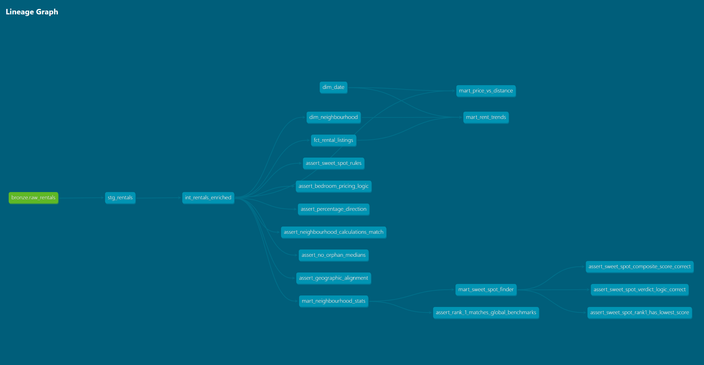
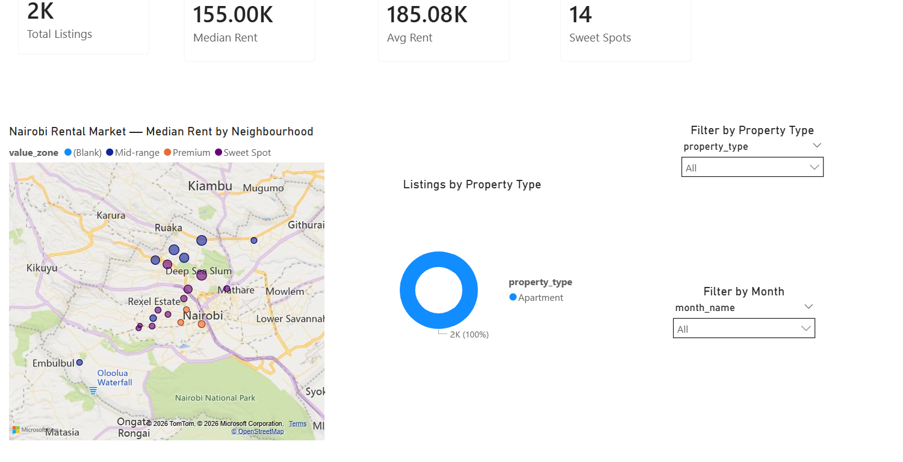
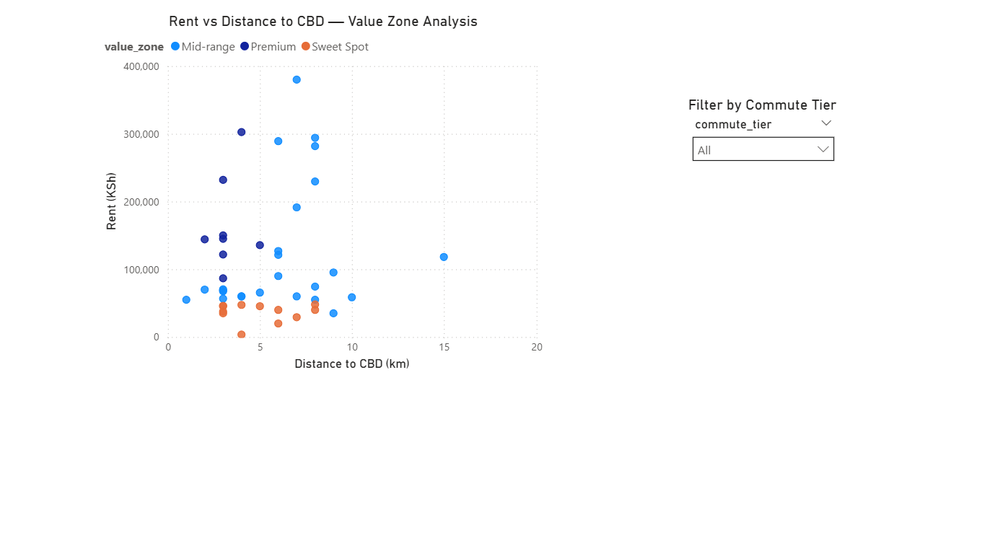
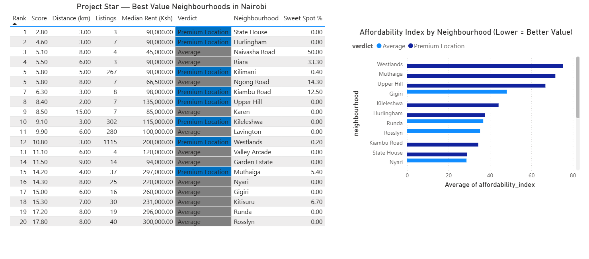
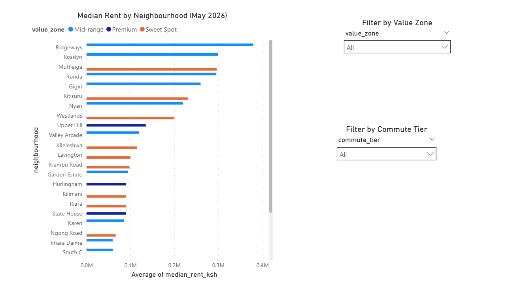

# NaiFlow Data Pipeline

> A production-grade real-time and batch ELT platform for Nairobi residential rental market analytics built on AWS, Apache Airflow, dbt, Redshift, and Power BI.

NaiFlow ingests, processes, validates, models, and visualizes Nairobi residential property listings using a hybrid **Lambda Architecture** that combines:

- A **real-time streaming pipeline** for low-latency ingestion and analytics
- A **distributed batch ETL pipeline** for historical backfills, recovery, and large-scale transformations

The platform ultimately serves curated analytical datasets into Power BI dashboards for spatial pricing analysis, neighbourhood intelligence, rental trend tracking, and “sweet spot” property discovery.

---

# Table of Contents

- [Overview](#overview)
- [Architecture](#architecture)
- [Tech Stack](#tech-stack)
- [Repository Structure](#repository-structure)
- [Data Ingestion Pipelines](#data-ingestion-pipelines)
  - [1. Real-Time Streaming Path (Speed Layer)](#1-real-time-streaming-path-speed-layer)
  - [2. Cold Storage & Batch Path (Batch-Layer)](#2-cold-storage--batch-path-batch-layer)
- [AWS Glue Batch ETL Pipeline](#aws-glue-batch-etl-pipeline)
- [Amazon Redshift Warehouse Design](#amazon-redshift-warehouse-design)
- [Airflow Orchestration Workflow (4-DAG Engine)](#airflow-orchestration-workflow-4-dag-engine)
- [dbt Analytics Engineering & Docker Execution](#dbt-analytics-engineering--docker-execution)
- [Data Quality & Validation Framework](#data-quality--validation-framework)
- [Testing Architecture](#testing-architecture)
- [CI/CD Workflow Automation](#cicd-workflow-automation)
- [Power BI Dashboards](#power-bi-dashboards)
- [Local Development Setup](#local-development-setup)
- [Running Tests](#running-tests)
- [Future Improvements](#future-improvements)

---

# Overview

NaiFlow automates the full lifecycle of Nairobi rental market data:

1. **Scrape & Stream Data**
   - AWS Lambda scrapers continuously collect rental listings from BuyRentKenya.

2. **Parallel Real-Time Distribution**
   - Records are streamed simultaneously into:
     - DynamoDB for low-latency operational access
     - Kinesis Firehose for Redshift warehouse ingestion
     - S3 Cold Storage for immutable historical backups

3. **Distributed Batch Processing**
   - AWS Glue Spark jobs process historical datasets stored in S3 and load cleaned audit datasets into Redshift batch tables.

4. **Warehouse Transformations**
   - dbt models transform raw streaming warehouse tables into structured silver, gold, and mart layers.

5. **Orchestrated Execution**
   - Apache Airflow coordinates ingestion checks, Glue execution, dbt transformations, and downstream data dependencies.

6. **Analytics Delivery**
   - Power BI dashboards expose pricing intelligence, spatial rental analysis, commute patterns, and neighbourhood market behavior.

---

# Architecture

```text
                                   ┌─────────────────────────────┐
                                   │    BuyRentKenya Scraper     │
                                   │  (AWS Lambda Cron Engine)   │
                                   └──────────────┬──────────────┘
                                                  │
                         ┌────────────────────────┴────────────────────────┐
                         │                                                 │
                         ▼ [Real-Time Speed Layer]                         ▼ [Historical Batch Layer]

              ┌───────────────────────────┐                  ┌───────────────────────────┐
              │    AWS API Gateway URL    │                  │     Amazon S3 Bucket      │
              └─────────────┬─────────────┘                  │    (raw-cold-storage)     │
                            │                                └─────────────┬─────────────┘
                            ▼                                              │

              ┌───────────────────────────┐                                │
              │   Amazon Kinesis Stream   │                                │
              └─────────────┬─────────────┘                                │
                            │                                              │

                 ┌──────────┴──────────┐                                   │
                 ▼                     ▼                                   ▼

        ┌───────────────────┐ ┌───────────────────┐          ┌───────────────────────────┐
        │  Amazon DynamoDB  │ │ Kinesis Firehose  │          │    AWS Glue Spark Job     │
        │ (Low-Latency Cache)│└─────────┬─────────┘          │   (Distributed PySpark)   │
        └───────────────────┘           │                    └─────────────┬─────────────┘
                                        │                                  │
                                        ▼                                  ▼

                             ┌───────────────────┐             ┌──────────────────────────────┐
                             │  S3 Staging Zone  │             │ bronze.cleaned_batch_rentals │
                             └─────────┬─────────┘             │  (Batch Historical Table)    │
                                       │                       └──────────────────────────────┘
                                       │
                          (Lambda COPY Trigger)
                                       │
                                       ▼

                  ┌──────────────────────────────────────────────────────┐
                  │              Amazon Redshift Warehouse               │
                  │                                                      │
                  │  bronze.raw_rentals_streaming  ← dbt source table   │
                  │  (Firehose + Lambda COPY pipeline)                  │
                  └──────────────────────────┬───────────────────────────┘
                                             │
                                             ▼

                           ┌─────────────────────────────────┐
                           │        dbt Transformations      │
                           │                                 │
                           │  staging → intermediate → gold  │
                           │               → marts           │
                           └─────────────────┬───────────────┘
                                             │
                                             ▼

                           ┌─────────────────────────────────┐
                           │      Power BI Dashboards        │
                           │ Nairobi Rental Market Analytics │
                           └─────────────────────────────────┘
```

---

# Tech Stack

## Cloud & Infrastructure

- AWS Lambda
- Amazon Kinesis Firehose
- Amazon DynamoDB
- Amazon S3
- AWS Glue
- Amazon Redshift
- AWS IAM
- AWS CloudWatch

## Data Engineering

- Apache Spark
- PySpark
- AWS Glue DynamicFrames
- SQL
- dbt Core
- dbt-redshift

## Orchestration & Containers

- Apache Airflow
- Docker
- Docker Compose

## Analytics & Visualization

- Power BI

## Testing & Quality

- Pytest
- dbt Tests
- AWS Glue Data Quality (DQDL)

---

# Repository Structure

```text
NaiFlow/
│
├── .github/
│   └── workflows/
│       └── run_tests.yml
│
├── airflow/
│   ├── client/
│   ├── config/
│   ├── dags/
│   │   ├── dag_1_ingestion.py
│   │   ├── dag_2_silver_transformations.py
│   │   ├── dag_3_gold_transformations.py
│   │   ├── dag_4_marts_transformations.py
│   │   └── pipeline_config.py
│   ├── logs/
│   └── plugins/
│
├── client/
│   ├── __init__.py
│   └── client.py
│
├── config/
│   ├── __init__.py
│   └── paths.py
│
├── docker/
│   ├── Dockerfile.airflow
│   ├── Dockerfile.dbt
│   ├── entrypoint.sh
│   ├── requirements-airflow.txt
│   └── requirements-dbt.txt
│
├── docs/
│   └── images/
│       ├── dbt_lineage_graph.png
│       ├── Market_Overview_Dashboard.png
│       ├── Price_vs_distance_Dashboard.png
│       ├── Project_Star_Dashboard.png
│       └── Rent_Trends_Dashboard.png
│
├── glue_elt_job/
│   └── s3_to_bronze_rentals_batch.py
│
├── lambdas/
│   ├── ingestion-lambda/
│   ├── s3-to-redshift-copy-trigger-lambda/
│   ├── stream-to-dynamodb-lambda/
│   ├── stream-to-s3-lambda/
│   └── visualization-lambda/
│
├── nairobi_dbt/
│   ├── analyses/
│   ├── dbt_packages/
│   ├── logs/
│   │
│   ├── macros/
│   │   └── custom_schema_name.sql
│   │
│   ├── models/
│   │   ├── staging/
│   │   │   ├── stg_rentals.sql
│   │   │   ├── schema.yml
│   │   │   └── source.yml
│   │   │
│   │   ├── intermediate/
│   │   │   ├── int_rentals_enriched.sql
│   │   │   └── schema.yml
│   │   │
│   │   ├── gold/
│   │   │   ├── dim_date.sql
│   │   │   ├── dim_neighbourhood.sql
│   │   │   ├── fct_rental_listings.sql
│   │   │   └── schema.yml
│   │   │
│   │   └── marts/
│   │       ├── mart_neighbourhood_stats.sql
│   │       ├── mart_price_vs_distance.sql
│   │       ├── mart_rent_trends.sql
│   │       ├── mart_sweet_spot_finder.sql
│   │       └── schema.yml
│   │
│   ├── tests/
│   │   ├── staging/
│   │   ├── intermediate/
│   │   │   ├── assert_bedroom_pricing_logic.sql
│   │   │   ├── assert_geographic_alignment.sql
│   │   │   ├── assert_neighbourhood_calculations_match.sql
│   │   │   ├── assert_no_orphan_medians.sql
│   │   │   ├── assert_percentage_direction.sql
│   │   │   └── assert_sweet_spot_rules.sql
│   │   │
│   │   ├── gold/
│   │   │   └── assert_gold_layer_no_join_leakage.sql
│   │   │
│   │   └── marts/
│   │       ├── assert_rank_1_matches_global_benchmark.sql
│   │       ├── assert_sweet_spot_composite_score_correct.sql
│   │       ├── assert_sweet_spot_rank1_has_lowest_score.sql
│   │       └── assert_sweet_spot_verdict_logic_correct.sql
│   │
│   ├── seeds/
│   ├── snapshots/
│   ├── target/
│   ├── dbt_project.yml
│   ├── packages.yml
│   ├── package-lock.yml
│   ├── profiles.yml
│   └── .user.yml
│
├── sql/
│   ├── 01_bronze_schema.sql
│   └── 02_firehose_redshift_setup.sql
│
├── tests/
│   ├── client/
│   ├── conftest.py
│   ├── test_client.py
│   └── test_pipeline.py
│
├── .env
├── .gitattributes
├── .gitignore
├── docker-compose.yml
├── pytest.ini
├── requirements-test.txt
└── README.md
```

---

# Data Ingestion Pipelines

NaiFlow utilizes a **Lambda Architecture** splitting ingestion paths to maximize pipeline uptime and preserve operational historical records.

---

## 1. Real-Time Streaming Path (Speed Layer)

### Lambda Core Execution

AWS Lambda scraper functions query BuyRentKenya and immediately distribute listing payloads into multiple downstream systems.

### Stream-to-DynamoDB

Listings are written into Amazon DynamoDB for ultra-low latency access and temporary operational caching.

### Stream-to-Firehose-Redshift

Payloads simultaneously stream into Amazon Kinesis Firehose.

Firehose:
- Buffers streaming events
- Writes micro-batches into an S3 staging bucket
- Preserves delivery durability before warehouse ingestion

### Automated Redshift COPY Trigger

Once Firehose deposits files into the staging bucket:

1. An S3 Event Notification triggers the COPY Lambda
2. The Lambda generates native Redshift `COPY` commands
3. Redshift ingests streaming records directly into:
   - `bronze.raw_rentals_streaming`

This is the primary source table powering the dbt transformation layer.

---

## 2. Cold Storage & Batch Path (Batch Layer)

### Stream-to-S3-Cold-Storage

A full immutable copy of every scraped payload is stored inside:

```text
s3://nairobi-rentals-raw/raw/
```

Partitioned by:

```text
year=YYYY/month=MM/day=DD/
```

This enables:
- Disaster recovery
- Historical replay
- Large-scale backfills
- Long-term archival retention

### S3 Cold Storage-to-Redshift Glue Job

Apache Airflow schedules a distributed AWS Glue Spark ETL job that:

- Reads raw historical files from S3
- Applies validation rules
- Casts schema types
- Removes duplicates
- Cleans malformed records
- Applies business logic classifications
- Writes:
  - Raw audit tables
  - Cleaned batch historical tables

Important:

The Glue-generated table:

```sql
bronze.cleaned_batch_rentals
```

is **NOT** the source for dbt transformations.

dbt models exclusively source from the real-time streaming ingestion table:

```sql
bronze.raw_rentals
```

which is populated via:

```text
Kinesis Firehose → S3 Staging → Lambda COPY → Redshift
```

The Glue batch tables primarily support:
- Historical auditing
- Batch recovery
- Replay operations
- Offline analytical verification

---

# AWS Glue Batch ETL Pipeline

The Glue job:

```text
glue_elt_job/s3_to_bronze_rentals_batch.py
```

implements a distributed PySpark ETL engine.

Key processing stages include:

## Source Validation

AWS Glue Data Quality (DQDL) validates:
- Row counts
- Required fields
- Null constraints
- Source integrity

## Schema Casting

Columns are explicitly cast into proper Spark datatypes:
- FLOAT
- INTEGER
- DATE
- TIMESTAMP

## Deduplication

Spark window functions eliminate duplicate records using:

```sql
ROW_NUMBER() OVER (
    PARTITION BY property_id
    ORDER BY ingested_at DESC
)
```

## Business Logic Enrichment

The ETL job computes:
- Distance-to-CBD metrics
- Price buckets
- Value zones
- Geospatial classifications
- Timestamp normalization

## Data Quality Enforcement

The job halts automatically if:
- Required fields are missing
- Invalid pricing ranges are detected
- Classification values violate constraints

## Redshift Loading

The Glue job writes:

### Raw Audit Copy

```sql
bronze.raw_batch_rentals
```

### Cleaned Batch Dataset

```sql
bronze.cleaned_batch_rentals
```

using optimized staging-table merge patterns.

---

# Amazon Redshift Warehouse Design

The warehouse is organized into layered schemas:

## Bronze Layer

Raw ingestion and landing tables.

Examples:
- `bronze.raw_rentals`
- `bronze.raw_batch_rentals`
- `bronze.cleaned_batch_rentals`

## Silver Layer

dbt intermediate transformations:
- cleaned fields
- standardized formats
- enrichment logic
- derived metrics

## Gold Layer

Business-ready star schema models:
- `fct_rental_listings`
- `dim_date`
- `dim_neighbourhood`

## Mart Layer

Executive analytics marts optimized for Power BI.

Examples:
- `mart_price_vs_distance`
- `mart_rent_trends`
- `mart_sweet_spot_finder`

---

# Airflow Orchestration Workflow (4-DAG Engine)

The scheduling system is componentized into a linear 4-DAG chain, strictly separating ingestion checks from transformations.

This prevents transformation failures from corrupting ingestion operations.

---

## 1. `dag_1_ingestion.py`

Responsibilities:

- Monitor Redshift ingestion tables
- Validate streaming pipeline freshness
- Trigger AWS Glue batch ETL jobs
- Validate Redshift warehouse connectivity
- Ensure upstream dependencies are healthy

---

## 2. `dag_2_silver_transformations.py`

Responsibilities:

- Launch dbt staging models
- Run dbt intermediate transformations
- Execute type normalization
- Clean malformed fields
- Build enriched silver datasets

dbt execution occurs inside ephemeral Docker containers via `DockerOperator`.

---

## 3. `dag_3_gold_transformations.py`

Responsibilities:

- Build dimensional models
- Generate fact tables
- Calculate rolling medians
- Compute neighbourhood metrics
- Execute advanced SQL transformations

---

## 4. `dag_4_marts_transformations.py`

Responsibilities:

- Materialize final analytical marts
- Build Power BI optimized tables
- Generate ranking metrics
- Compute sweet-spot scoring logic
- Produce reporting-ready datasets

---

# dbt Analytics Engineering & Docker Execution

The `nairobi_dbt` project implements layered analytics engineering transformations.

---

## Staging Layer (`models/staging/`)

Responsibilities:
- Source raw streaming warehouse tables
- Normalize column names
- Apply datatype standardization
- Clean malformed string fields

---

## Intermediate Layer (`models/intermediate/`)

Responsibilities:
- Enrich listings
- Compute spatial metrics
- Calculate neighbourhood medians
- Apply fuzzy location matching
- Derive pricing intelligence metrics

Examples:
- `price_vs_neighbourhood_median`
- `dist_to_archives_km`

---

## Gold Layer (`models/gold/`)

Builds star-schema warehouse models:

### Fact Tables
- `fact_rental_listings`

### Dimension Tables
- `dim_date`
- `dim_neighbourhood`

---

## Mart Layer (`models/marts/`)

Power BI optimized marts:
- `mart_rent_trends`
- `mart_price_vs_distance`
- `mart_sweet_spot_finder`
- `mart_neighbourhood_stats`

---

## Ephemeral Docker Architecture & Container Orchestration

dbt execution is fully containerized.

Airflow launches dbt transformations using:

```text
docker/Dockerfile.dbt
```

The runtime invokes:

```text
docker/entrypoint.sh
```

which:
- Loads environment variables
- Dynamically configures dbt profiles
- Injects Redshift credentials
- Executes dbt commands

Main execution command:

```bash
dbt build --profiles-dir .dbt/ --target prod
```

Once execution finishes:
- the container shuts down
- resources are released
- execution logs are persisted

---
#### Interactive Data Lineage

Below is the compiled structural dependency graph illustrating the directional transformation flow from raw ingestion source endpoints up into the final production analytical star schema:




# Data Quality & Validation Framework

NaiFlow enforces quality validation across:
- ingestion
- transformation
- warehouse modeling
- reporting layers

---

## AWS Glue DQDL Rules

Glue validates:
- row counts
- required fields
- categorical constraints
- pricing boundaries

Example:
- prices must remain between:
  - `3000`
  - `2000000`

---

## dbt Tests

dbt schema and custom SQL tests validate:
- uniqueness
- referential integrity
- null constraints
- business logic correctness
- mart scoring accuracy

Examples:
- `assert_sweet_spot_rules.sql`
- `assert_geographic_alignment.sql`
- `assert_gold_layer_no_join_leakage.sql`

---

# Testing Architecture

## Pytest Unit Testing

Python test coverage includes:

### Client Testing
- API request validation
- parser integrity
- scraper reliability

### Pipeline Testing
- DAG validation
- ingestion behavior
- dependency orchestration

### Mock Frameworks

Tests isolate:
- network calls
- API keys
- cache files
- environment variables

using:
- monkeypatch
- fixtures
- temporary file systems

---

# CI/CD Workflow Automation

GitHub Actions automates:
- testing
- validation
- deployment checks

Workflow file:

```text
.github/workflows/run_tests.yml
```

Pipeline responsibilities:
- install dependencies
- execute pytest
- validate dbt builds
- enforce code quality
- prevent broken merges

---

# Power BI Dashboards

Dashboard assets are stored in:

```text
docs/images/

---

## Market Overview Dashboard



Provides:
- rental distribution analysis
- neighbourhood summaries
- pricing segmentation
- market-wide KPIs

---

## Price vs Distance Dashboard



Analyzes:
- CBD distance decay
- commute pricing behavior
- neighbourhood accessibility
- rental affordability

---

## Project Star Dashboard



Highlights:
- neighbourhood ranking engine
- affordability index calculations
- sweet-spot discovery
- investment-oriented rental intelligence
- value-zone classification

---

## Rent Trends Dashboard



Tracks:
- historical rent movement
- temporal pricing trends
- rolling averages
- monthly and yearly changes

# Local Development Setup

## Prerequisites

- Docker Desktop
- Docker Compose
- Python 3.9+
- AWS credentials configured
- Redshift access configured

---

## Clone Repository

```bash
git clone https://github.com/laura-minayo5/NaiFlow_Data_Pipeline.git

cd NaiFlow_Data_Pipeline
```

---

## Create Environment Variables

Create:

```text
.env
```

Populate required:
- AWS credentials
- Redshift credentials
- Airflow configs
- dbt environment variables

---

## Build Containers

```bash
docker compose build
```

---

## Start Airflow Stack

```bash
docker compose up -d
```

---

## Access Airflow

```text
http://localhost:8080
```

---

# Running Tests

## Pytest

```bash
pytest tests/ -v
```

## dbt Tests

```bash
dbt test
```

---

# Future Improvements

Potential roadmap additions:

- Kafka-based ingestion
- Real-time anomaly detection
- ML rental price forecasting
- Geospatial clustering models
- Lakehouse architecture migration
- Terraform infrastructure provisioning
- Great Expectations integration
- Real-time dashboard streaming

---

# Author

Built by Laura Minayo

Focused on modern cloud-native data engineering, streaming systems, distributed ETL pipelines, analytics engineering, and production-grade warehouse orchestration.